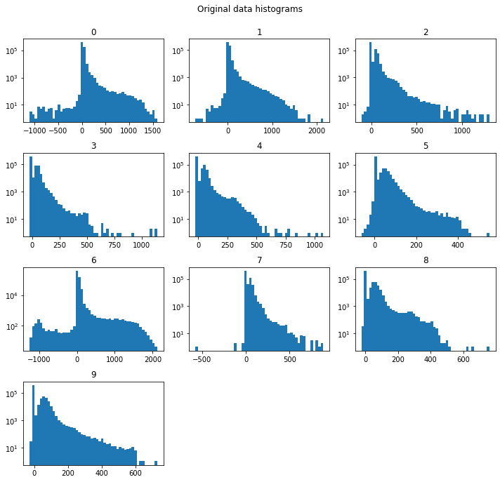
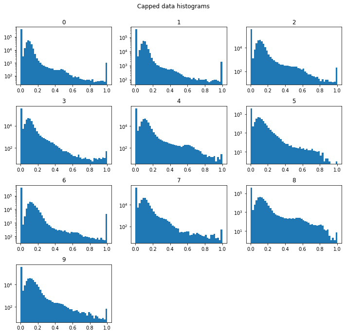
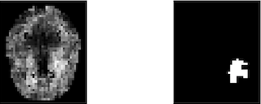

# Project journal
## Implementing basic pipelines 

|Start Date|End Date  |
|----------|----------|
|2020-04-01|2020-05-30|

### Description

Implemented basic pipelines for topological and non-topological stroke prediction based on receptive fields. 

**Example Pipeline overview**
1. Subimage creatio (Receptive fields) with multiple widths via `RollingSubImageTransformer`
2. Feature creation: Compute persistance in homology dimensions (0, 1, 2) and obtain persistence entropies and wasserstein amplitude per subimage for subimages of different widths
3. Split Train/Test data
4. Fit and test prediction of voxel-wise infarction with `RandomForestClassifier`


### Delivrables

- [x] topological feature creation and analysis pipeline based on giotto
- [x] receptive field pipeline as a baseline for comparison
- [x] working example [notebook](./data_exploration/topological_feature_creation_and_classification_pipeline.ipynb) 

### Results 

The basic implementation of this pipeline does however not seem to learn anything yet, and feature creation remains very slow:
```
Dice: 0.0
ROC AUC: 0.49997742739266
Feature Creation timing: 46438.243881464005
Feature Classification and Prediction timing: 5029.564110517502
```
## Normalisation/Standardisation 

|Start Date|End Date  |
|----------|----------|
|2020-06-01|2020-06-XX|

### Description

Data should come from the same distribution. To get back this original distribution, a capping is applied to each sample.

**Capping strategy**
- data is capped to 0-500
- data outside this range does not seem relevant for vascular analysis
- x < 0 -> mostly air
- x > 500 -> mostly rest of bones, some vascular artefacts, calcifications 

### Delivrables

- [x] Visualisation of the normalisation in a [notebook](./data_exploration/normalisation.ipynb).
- [ ] Todo: evaluate relevance of standardisation

|Original dataset| Capped dataset |
|----------|----------|
| | |

### Conclusion

- Data should be capped between 0-500 Hu

## Data balancing 

|Start Date|End Date  |
|----------|----------|
|2020-06-01|2020-06-20|

### Description

Stroke imaging data is extremely unbalanced with a positive to negative voxel sample ratio of 2:100 (number of infarcted voxels: number of non-infarcted voxels), making data balancing necessary for effective learning algorithms. Two main methods are used here:
- Restriction of training and evaluation to voxels within the brain
- Balance training data for better learning 

### Delivrables

- [x] Mask restriction: restrict training and testing to brain mask 
- [x] Undersampling: rebalance training data by undersampling negative samples (non infarcted) to obtain a 1:1 ratio

|Working example| Results |
|----------|----------|
| | Train Dice: 1.0 <br>Train ROC AUC: 1.0 <br>Test Dice: 0.04665507672762529 <br>Test ROC AUC: 0.6557306214976681 <br>Feature Creation timing: 676.7280170917511 <br>Feature Classification and Prediction timing: 111.9262273311615|

### Conclusion

- Balancing is necessary for a learning algorithm for this dataset.
- Balancing speeds up feature creation significantly.  

